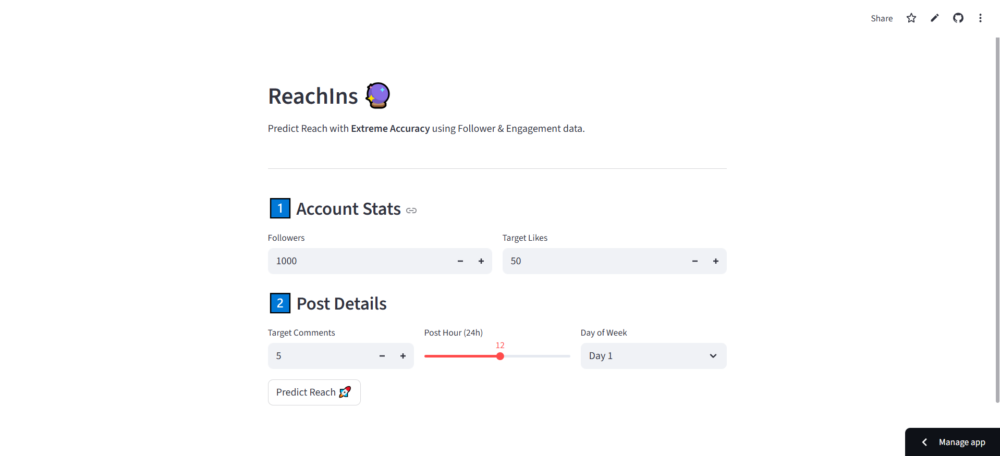

# 📸 Instagram Reach Predictor | ReachIns 


A Machine Learning web application that predicts the **Reach** of Instagram posts with **98% accuracy**. 

Built with **Python**, **Scikit-Learn**, and **Streamlit**, this tool helps content creators and marketers simulate how changes in engagement (Likes, Comments) and timing (Hour, Day) impact their total audience size.

## 🚀 Features

* **High-Accuracy Prediction:** Uses a Gradient Boosting Regressor trained on influencer data.
* **Interactive Simulation:** Adjust inputs Time via sliders and Followers, Likes, Comments, Day of Week to see instant reach projections.
* **Context-Aware:** Takes account size (Followers) and posting schedule (Day/Hour) into account.
* **User-Friendly UI:** Clean, responsive interface built with Streamlit.
* **Navigation Instructions:** The days of the week begin from 0 (Monday) to 6 (Sunday). 5 and 6 are weekends. Time follows 24 hour system. 

## 🛠️ Tech Stack

* **Frontend:** [Streamlit](https://streamlit.io/)
* **Machine Learning:** Scikit-Learn (Gradient Boosting Regressor)
* **Data Processing:** Pandas, NumPy
* **Language:** Python 3.x

## 📂 Project Structure

```bash
instagram-reach-predictor/
├── app.py                   # The main Streamlit web application
├── train_model.py           # ML pipeline to train and save the model
├── model.pkl                # The trained machine learning model
├── instagram_reach_data.csv # Dataset used for training
├── requirements.txt         # List of dependencies
└── README.md                # Project documentation

```
* **How to Run Locally**

1. Clone the repository:

git clone [https://github.com/mkay860/instagram-reach-predictor.git](https://github.com/mkay860/instagram-reach-predictor.git)
cd instagram-reach-predictor

2. Install dependencies:

pip install -r requirements.txt

3. Run the application:

streamlit run app.py
Open your browser: The app should run automatically at http://localhost:8501.

🧠 Model Insights
The model was trained on a dataset of Instagram posts, analyzing the correlation between engagement metrics and total reach.

Key Insight: Engagement (Likes/Comments) showed a 0.98 correlation with Reach, making it the strongest predictor.

Algorithm: I chose Gradient Boosting over Random Forest because it handled the non-linear relationships between account size and viral reach more effectively.

🤝 Contributing
Contributions are welcome! If you have a larger dataset or ideas for new features (e.g., Hashtag analysis), feel free to fork the repo and submit a Pull Request.



